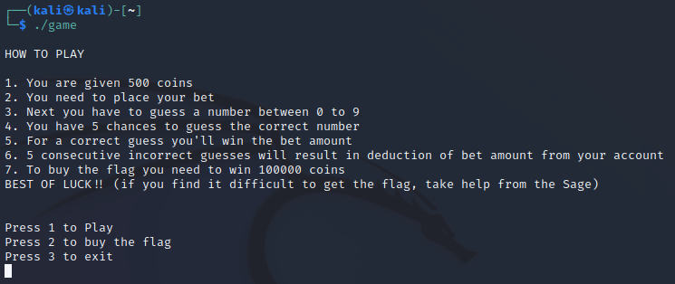
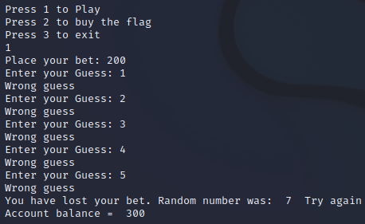
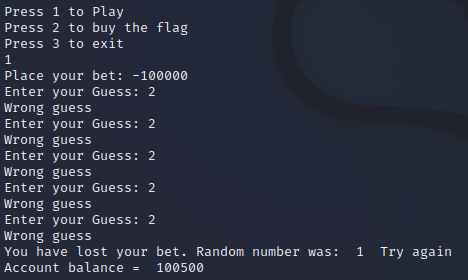
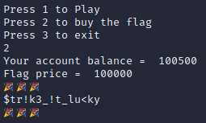

# VishwaCTF 2022
## Bet Game


**Challenge**

Try your luck to get the flag.

Attachments:  
game  
sage.py  


**Solution** 

When we run the game we can see the following message:



We can try to play to see how the game behaves:



As we can see it would take us a long time to get to 100000, even if we were very lucky. 
So what can we do to earn a lot of money quick? Let's try to bypass the logic of the game by trying with negative value of the bet:



Voilà! The game does not check our input for negative values. In this way we have enough money for the flag with just one bet:



In case of problems with getting the flag, there was also a hint provided in sage.py:

```python
sage_words = "ǏLJǣŻǏƟƣƷƫƣƷƛŻƷƓƛƓǏƣǗƓƯǣ"

def _0000xf69(passed_strr):
    _0000xf42=''
    for _0000xf72 in passed_strr:
        _0000xf96 = _0000xf106(_0000xf72)
        _0000xf42 = _0000xf42+chr(2*(ord(_0000xf96))+1)
        
        
    return _0000xf42

def _0000xf106(passed_char):
    return chr(2*(ord(passed_char))-1)


print("The biggest clue lies in your input")  

_0000xf420 = input("Your input: ")
if sage_words == _0000xf69(_0000xf420):
    print("!_h0p3_y0u_g0t_!t_n0w")
else:
    print("t@k3_f3w_5t3p5_b@<k")  
```

I wrote a simple loop to reverse the logic of modifying the user input:

```python
sage_words = "ǏLJǣŻǏƟƣƷƫƣƷƛŻƷƓƛƓǏƣǗƓƯǣ"

original_str = ''
for character in sage_words:
    original_str += chr(int((ord(character)+1)/4))
print(original_str)
```

Output:
```
try_thinking_negetively
```
