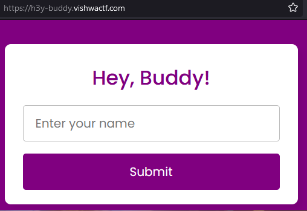
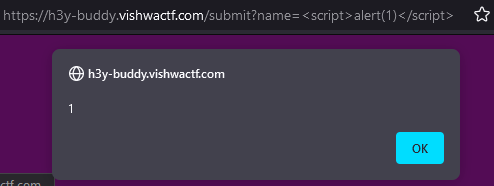
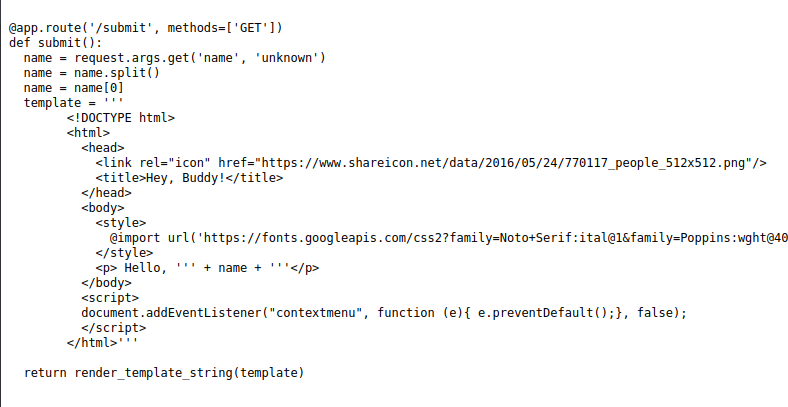
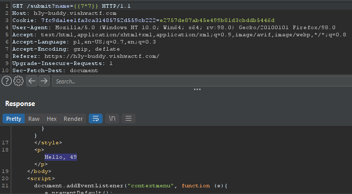
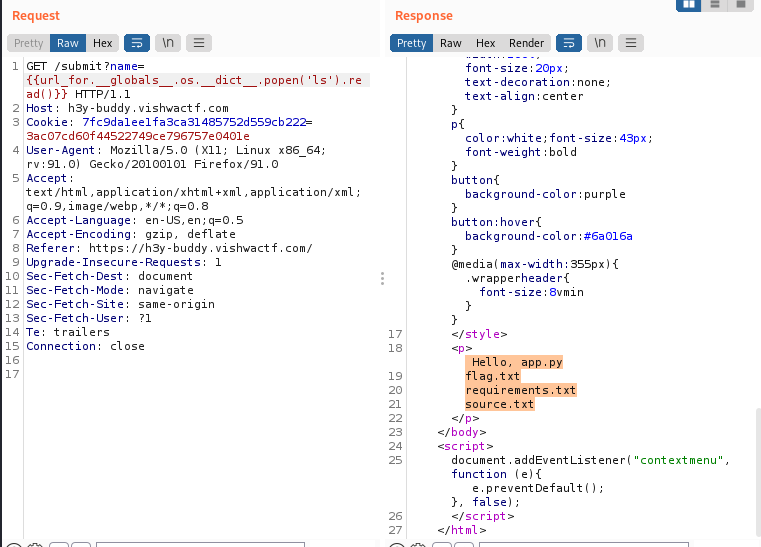
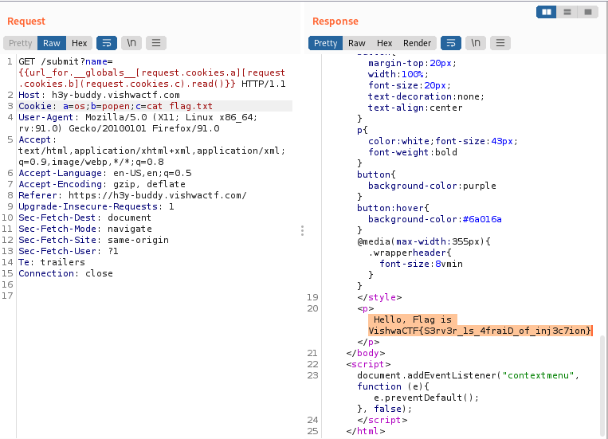

# VishwaCTF 2022
## Hey Buddy!

**Challenge**

Hey Buddy, Give me your name I will display your name on my website. Yes exactly, there is nothing in this website.  
Url - https://h3y-buddy.vishwactf.com/

**Solution**  

In this challenge, we are greeted on the website with a window that allows us to enter our name:  

At first I went for a simple xss payload:  

But as successful as it was, it was a road to nowhere.
Then I noticed that the creators of the task conveniently provided us with a sourcecode:

At this point it was pretty obvious. To make sure that we are dealing with SSTI i tried with simple payload:

Success ^^ Now we can exploit this.  
After poking around and trying diffrent payloads I was able to list files on the server: 

  

I could also run commands like 'uname'. However it wasn't that simple to cat flag.txt - there was a problem with the space in the command - url encoding it didn't seem to work. After another few minutes I found payload that worked for me:  

  

Yay, flag found :D  
Another way to do this was simply using $IFS in beetwen 'cat' and 'flag.txt'

